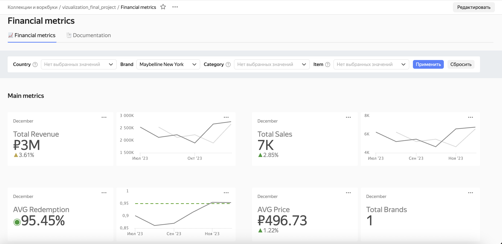
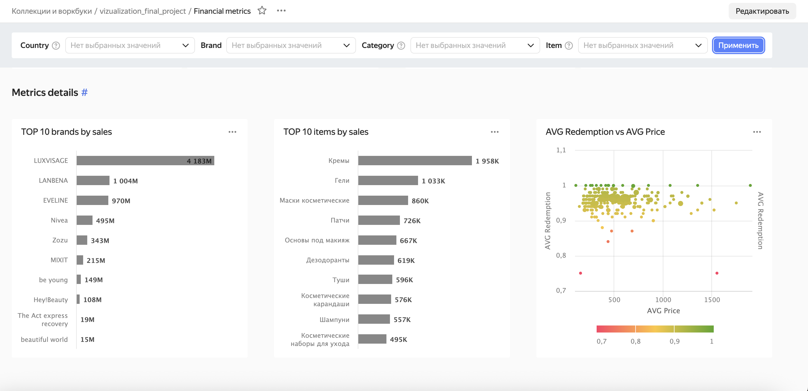
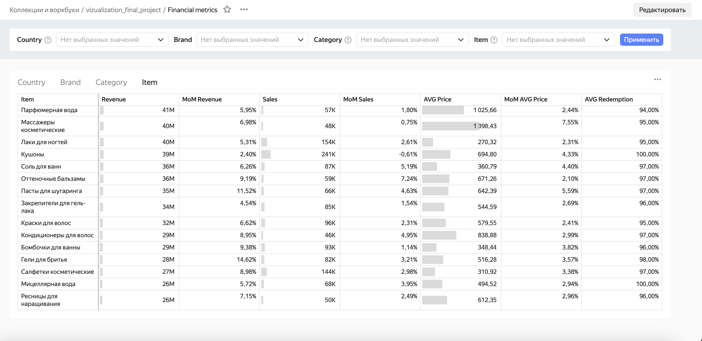

# Кейс: дашборд для e-commerce

🔗 [**Financial metrics** – дашборд для анализа основных финансовых показателей маркетплейса](https://datalens.yandex/ahy2okxwgs88w)

Реализован в 

### Структура дашборда

Дашборд состоит из 2 разделов: `Main metrics` и `Metrics details`

В разделе `Main metrics` представлены:
- KPI карточки со значениями и приростом ключевых метрик в отчетном месяце
- линейные диаграммы с динамикой ключевых метрик и линией плана
- индикатор количества брендов, попадающих в выборку при фильтрации

В разделе `Metrics details` представлены:
- линейчатые диаграммы, отражающие лидирующие по продажам бренды и типы товаров
- точечная диаграмма, отражающая зависимость процента выкупа от стоимости товара
- таблица с метриками в разрезе по категориям и типам товаров, брендам, странам

Реализована возможность применения фильтров

